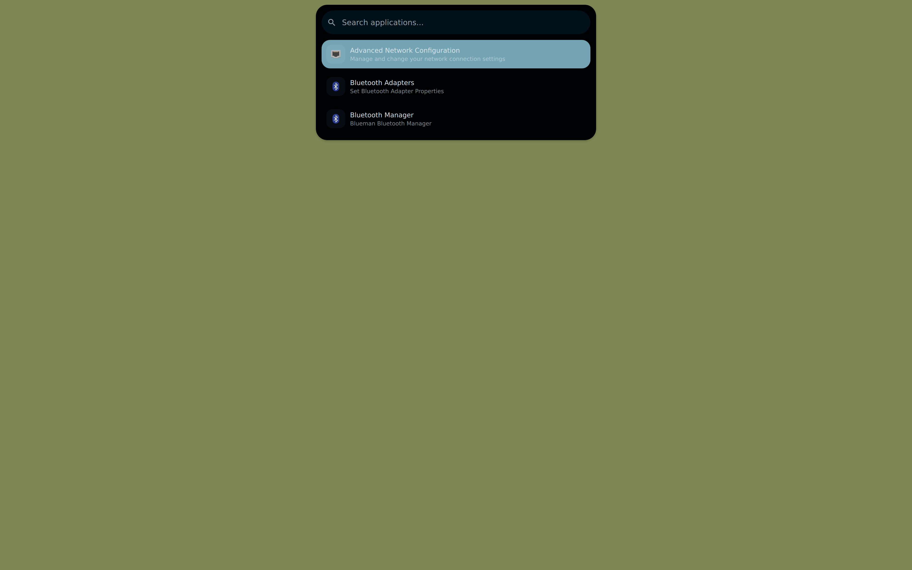
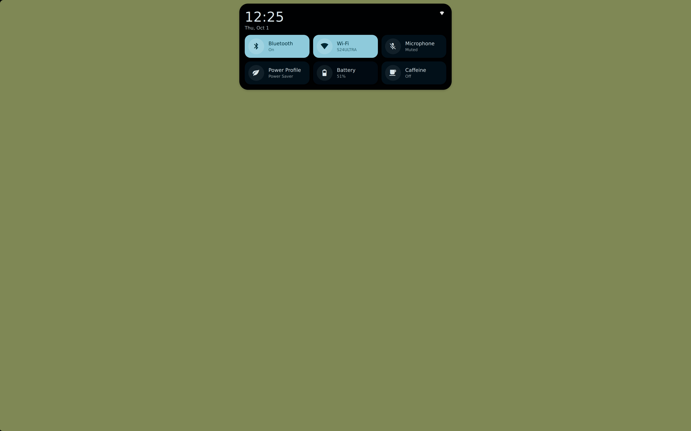
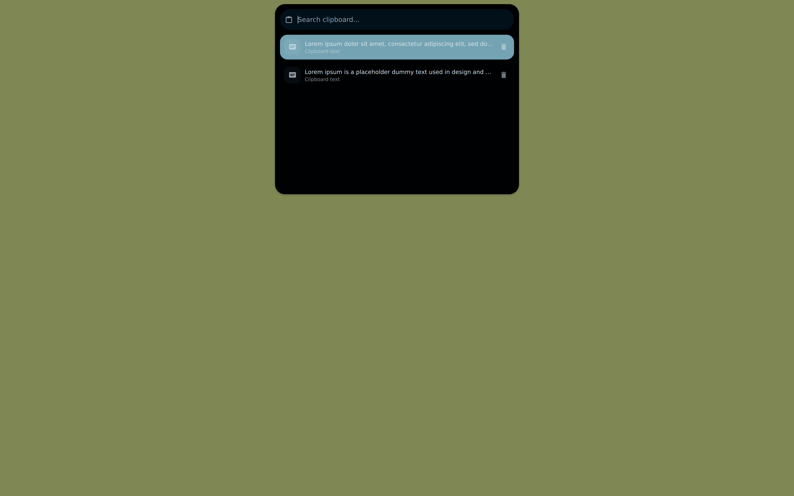
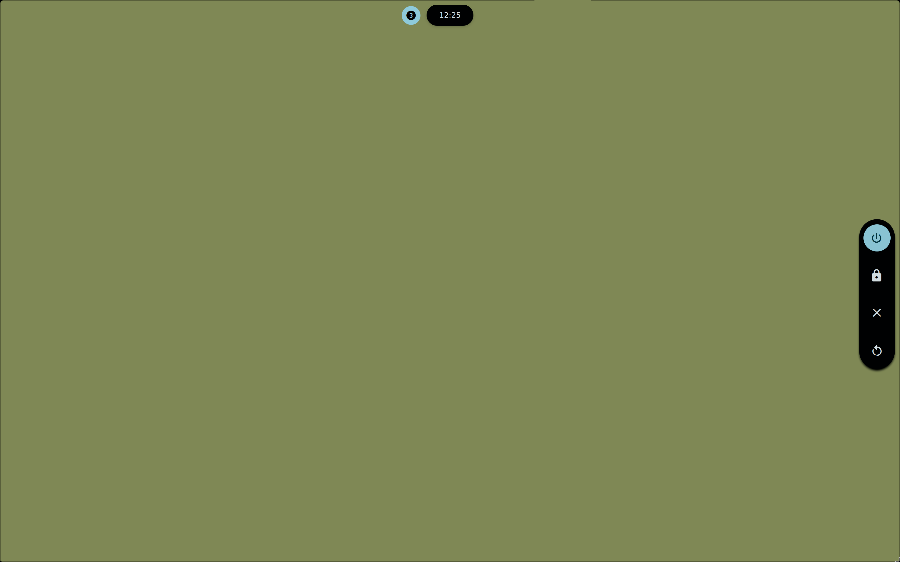

# Quickshell Pill
A simple and minimal quickshell pill implementation.

## What's included
- Application launcher: keyboard/search-driven launcher for starting apps and switching workspaces.
- Clipboard manager: history, quick paste and clipboard actions (uses clipse backend).
- Microphone & Caffeine toggles: helper scripts to toggle microphone mute and inhibit idle/sleep, both with on-screen OSD feedback.
- Notification manager: central notifications display integrated into the bar.
- Quick panel: quick access to Wi‑Fi, Bluetooth, Bluetooth tray and other quick actions; supports tray icons.
- Power menu: compact UI for shutdown, reboot, lock and logout; callable both from UI and scripts.
- Rounded screen corners: optional decorative rounded corners layer.

## IPC handler (qs ipc) — overview
Quickshell exposes an IPC API that the `qs` binary exposes as `qs ipc call <target> <function>`. Many helper scripts in `bin/` use a small wrapper (see `bin/mic_toggle.sh` and `bin/caffeine.sh`) that calls `qs ipc --any-display --newest call ...` to ensure the message reaches the running instance.

Recommended form (matches scripts shipped here):

  qs ipc --any-display --newest call <target> <function>

Or the shorter form if you're on the same display/session and don't need the extra flags:

  qs ipc call <target> <function>


## Available IPC targets and functions
List of targets implemented by the QML modules and useful example invocations.

- launcher
  - toggle
  - The launcher supports special inputs:
    - `:{math expression}` — evaluate simple math expressions (e.g. `:2+2*3` or `:log(8,3)`) and show the result directly in the launcher.
    - URLs are detected automatically; typing or pasting a URL opens it in the system default browser if activated.
    - If a typed query yields no local matches, the launcher falls back to a web search using the system default browser (Google is used unless a different search engine is configured in user settings).
  - Example: `qs ipc call launcher toggle` — open/close the application launcher panel.

- clipboard
  - toggle
  - Example: `qs ipc call clipboard toggle` — open/close the clipboard history panel.

- osd
  - volume
  - brightness
  - caffeine
  - microphone (alias: mic)
  - Examples:
    - `qs ipc call osd volume` — show the volume OSD.
    - `qs ipc call osd brightness` — show the brightness OSD.
    - `qs ipc --any-display --newest call osd caffeine` — toggle/show the caffeine OSD (used by systemd-inhibit wrapper).
    - `qs ipc call osd microphone` or `qs ipc call osd mic` — show the microphone OSD.

- powerMenu
  - toggle
  - open
  - close
  - Examples:
    - `qs ipc call powerMenu toggle` — toggle the power menu UI.
    - `qs ipc call powerMenu open` — open power menu.
    - `qs ipc call powerMenu close` — close power menu.

- root (corner module)
  - toggle
  - Example: `qs ipc call root toggle` — toggle the rounded-corners decoration visibility.


## Helper scripts (bin/)
- bin/mic_toggle.sh
  - Usage: `mic_toggle.sh [toggle|state]` — toggles microphone mute and notifies the OSD via `qs ipc`.
  - Internally calls: `qs ipc --any-display --newest call osd mic` after toggling state.

- bin/caffeine.sh
  - Usage: `caffeine.sh {start|stop|toggle|state|status|icon}` — manages a systemd-inhibit sleep blocker and notifies the OSD.
  - Internally calls: `qs ipc --any-display --newest call osd caffeine` when state changes.

- bin/powermenu.sh
  - Used by the power menu UI to perform the actual actions (poweroff, reboot, lock, exit). It can also be called directly with an action argument.


## Examples and tips
- Use the wrapper flags when invoking from external contexts (hotkeys, background scripts):
  `qs ipc --any-display --newest call osd volume`

- Scripts shipped here show idiomatic usage; adapt them for custom keybindings.

- If `qs` is not responding, ensure the Quickshell process is running in the current session; the `--any-display --newest` flags help with multi-seat or multi-display setups.


## Contributing
Open an issue or PR describing missing IPC commands or desired features. When adding IPC handlers, document the new target and functions in this README so scripts and keybindings can call them reliably.

## Screenshots
A few screenshots demonstrating the UI components shipped with Quickshell. Open the files in the `assets/` folder or reference them in documentation.

- Launcher: 
- Bar: 
- Quick panel: 
- Clipboard: 
- Power menu: 
- Notifications: 
- Volume OSD (slider): 
- Brightness OSD (slider): 
- Caffeine (on): 
- Caffeine (off): 
- Microphone (on): 
- Microphone (off): 
- Volume (muted): 
- Battery (charging): 
- Battery (low): 

If any image does not display in your viewer, open the file directly from the `assets/` folder.

## Usage with NixOS / Home Manager

Add this repository as a flake input in your configuration:

```nix
{
  inputs.quickshell.url = "github:nautilor/quickshell-island";

  # ...
}
```

Then import the flake as a Home Manager module and enable it:

```nix
{
  imports = [
    inputs.quickshell
  ];

  programs.quickshell.enable = true;
}
```

Enabling the module will make the repository's `bin/`, `modules/`, and `shell.qml` available under `~/.config/quickshell/`.

